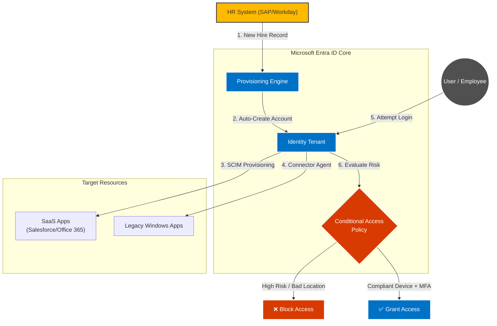

# 📄 TechCorp Enterprises IAM Modernization Roadmap

**Document Type:** Solution Design Specification  
**Author:** Lee-roy Breat  
**Status:** Draft / Proposal  
**Technology Stack:** Microsoft Entra ID, Azure, Zero Trust

---

## 1. Executive Summary
TechCorp Enterprises is navigating a complex digital transformation across 100+ countries. The current manual approach to identity management is a bottleneck to operational speed and a liability for security. This document outlines a dual-pillar solution focusing on **Automated User Lifecycle Management (ULM)** and **Zero Trust Access Control**, designed to reduce friction for 150,000+ employees while hardening the security perimeter.

---

## 2. Focus Area 1: Enhanced User Lifecycle Management (ULM)

### The Solution: "The Golden Record" Automation Strategy
We will move TechCorp from a "Ticket-Based" provisioning model to a "Rule-Based" automated model. The goal is to ensure that the HR system acts as the single source of truth.

#### Technical Implementation
1.  **HR-Driven Provisioning:**
    * **Inbound Provisioning:** Configure **Microsoft Entra ID** to integrate directly with TechCorp’s Human Capital Management (HCM) system.
    * **The Logic:** When a new employee record is created in HR, the IAM system detects the change via API.
2.  **Dynamic Group Assignment:**
    * Implement **Dynamic Membership Rules**.
    * *Logic:* `IF Department = 'Sales' AND Country = 'Zimbabwe', THEN Add to 'Sales-Zim-Access-Group'.`
3.  **SCIM Bridging:**
    * Utilize **SCIM protocol** to push identities from Entra ID into downstream SaaS apps (Salesforce, Slack) automatically.

### System Architecture Diagram

> **Rationale:** Automation ensures instant productivity for new hires (Joiners) and instant revocation of access for terminated employees (Leavers).

---

## 3. Focus Area 2: Strengthening Access Control Mechanisms

### The Solution: Identity-Centric Zero Trust
We will implement a **Zero Trust** model where identity is the new perimeter. Access will no longer be binary (Open/Closed) but contextual.

#### Technical Implementation
1.  **Role-Based Access Control (RBAC):**
    * Define "Enterprise Roles" that map to job functions. Access is granted to the *role*, not the user.
2.  **Conditional Access Policies (The "Smart Gatekeeper"):**
    * Configure policies that evaluate context before granting access.
    * *Scenario:* Login from unknown device + high-risk country → **Block**.
3.  **Adaptive Multi-Factor Authentication (MFA):**
    * Enforce "Number Matching" to prevent MFA Fatigue attacks.

#### Technologies Utilized
* **Microsoft Entra Conditional Access:** The decision engine.
* **Azure RBAC:** For resource management.
* **Privileged Identity Management (PIM):** Just-In-Time (JIT) access for admins.

---

## 4. Operational Efficiency Analysis

| Current Process (Pain Point) | New Solution Workflow | Efficiency Gain |
| :--- | :--- | :--- |
| **Onboarding:** Manual tickets; 3-day wait. | **Automated:** HR hires user; Entra ID creates accounts instantly. | **95% reduction** in "Time-to-Productivity." |
| **Help Desk:** Flooded with password resets. | **Self-Service:** SSPR portal deployed. | **30% reduction** in Help Desk volume. |
| **Auditing:** Manual spreadsheets. | **Reporting:** Automated logs via Graph API. | Real-time global compliance. |

---

## 5. Strategic Value & Conclusion
This IAM design shifts TechCorp from a reactive, manual security posture to a proactive, automated one. By leveraging the Microsoft ecosystem, we ensure compatibility with existing Windows infrastructure while creating a bridge to the cloud.
